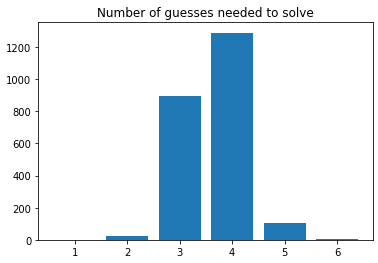

# Wordle Solver! 🟩 🟩 🟩 🟩 🟩

### This project makes use of information theory to solve wordle puzzles, utilising concepts based on the [video](https://www.youtube.com/watch?v=v68zYyaEmEA) by 3Blue1Brown.

<br>

### Installation 🧰

```
git clone https://github.com/gtxn/wordle-solver
```

<br>

### Demo 📺

The demo shows the algorithm on a randomly generated word.
To run this demo, go into the wordle-solver directory and run demo.py.


https://user-images.githubusercontent.com/59089164/155631763-caeacfd9-b77c-42af-82a4-b44cec553c85.mov


```
cd wordle-solver
```

```
python3 demo.py
```

<br>

### Solver 🧮

The solver runs on based on user input, and is meant to be used as an aid for a user trying to solve a wordle puzzle.
To run this demo, go into the wordle-solver directory and run solver.py.


https://user-images.githubusercontent.com/59089164/155632056-343a7b71-f50d-4aa1-9f44-473a076022c8.mov


```
cd wordle-solver
```

```
python3 solver.py
```

<br>

### Performance 💯

Graph of performance :
<br>
<br>

<br>

Average number of guesses🙋 : 3.64
Time needed⏳ : 94mins for 2315 puzzles -> 2.4s per puzzle
